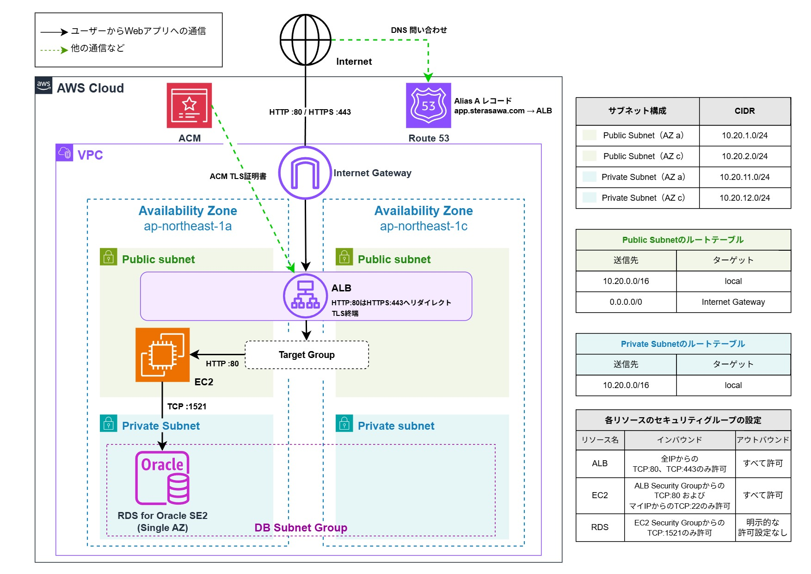
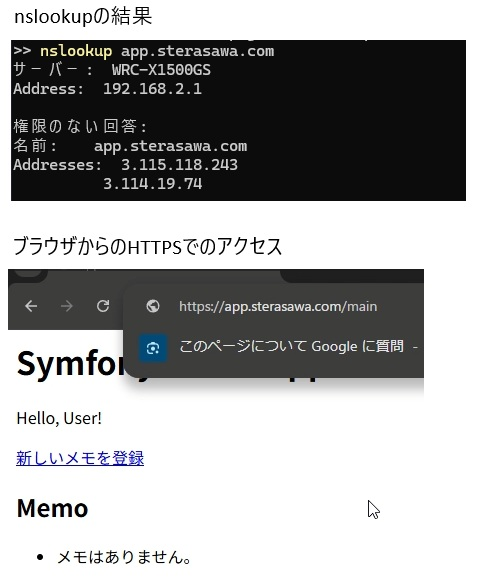
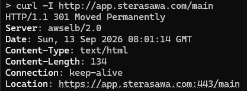
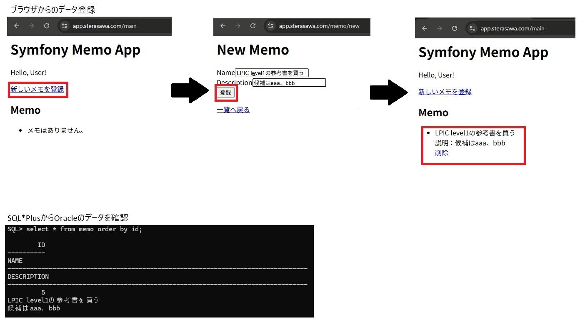

# Symfony + Apache + Oracle + AWSを使用したポートフォリオ

閲覧いただきありがとうございます。

## 概要

Linux、Webサーバ、データベースを含むWebアプリケーション基盤の構築を学習するため、
Symfony + Apache + Oracleを用いた簡易WebアプリケーションをAWS上に構築しました。

VPC、EC2、RDS、ALBなどの主要なAWSリソースはTerraformで構築し、
Route 53による名前解決と、ALB・ACMを利用したHTTPSアクセスが可能な構成としています。
なお、Route 53のAlias Aレコード設定とACM証明書の発行は手動で行いました。

また、アプリケーション開発自体は主目的ではないため、
メモの登録・参照・削除ができる最小限の機能としています。

## AWS構成図

## 工夫した点・設計上の考慮点

### Docker環境で検証後にAWSに展開

EC2上で直接検証を進めると、検証中も費用が発生するほか、
アプリケーション設定とAWS側の問題を切り分けにくくなると考えました。

そのため、まずローカルのDocker環境でApache、PHP、Symfonyの構成を検証し、
必要なパッケージや設定を確認したうえでAWS上へ展開しました。

### ALBによるHTTPS化

インターネットからのWebアクセスはALBで受け付け、
HTTP :80へのアクセスはHTTPS :443へリダイレクトしています。

TLS証明書にはACMを利用し、TLS終端はALBで行っています。
ALBからEC2上のApacheまではHTTP :80で通信しています。

### 接続元の制限

EC2では、管理用のSSH :22と、
ALBのSecurity GroupからのHTTP :80のみを許可しています。

RDSでは、EC2のSecurity GroupからのTCP :1521のみを許可しています。
また、RDSはPrivate Subnetに配置し、Public accessを無効化しています。

管理用のSSH :22については、自宅のグローバルIPアドレスを `/32` で指定し、
接続元を制限しています。

## 使用技術

- AWS
  - VPC
  - Public / Private Subnet
  - Internet Gateway
  - Route Table
  - Security Group
  - Application Load Balancer
  - Target Group
  - EC2
  - Elastic IP
  - RDS for Oracle SE2
  - DB Subnet Group
  - Route 53
  - AWS Certificate Manager（ACM）
- OS / Middleware
  - RHEL 10.2
  - Apache HTTP Server 2.4.63
  - PHP 8.4.25 / PHP-FPM
  - Composer
  - Oracle Instant Client / OCI8
- Application
  - Symfony 8.1.6
  - Doctrine ORM
  - Twig
- Database
  - Oracle Database SE2
  - SQLite（ローカル検証）
- Infrastructure as Code
  - Terraform

## 動作確認

### HTTPSでのWebアプリケーション表示

`app.sterasawa.com` がRoute 53でALBへ名前解決され、
ALB経由でEC2上のSymfonyアプリケーションが表示されることを確認しました。

また、HTTP :80でアクセスした場合は、
ALBによってHTTPS :443へリダイレクトされることを確認しました。

### Oracleへのデータ保存

ブラウザからメモを登録し、
SQL*PlusからRDS for Oracleへ接続して、
同じデータがOracle Databaseへ保存されていることを確認しました。

## 学んだこと

- Symfony、Apache、Oracleを組み合わせたWebアプリケーション基盤の構築方法を学びました
- ApacheやSymfonyのログなどを確認しながらトラブルシューティングを行い、問題が発生している通信区間を切り分けることの重要性を学びました
- ALBとACMを利用したHTTPS化と、Route 53を利用した独自ドメインでの公開方法を学びました
- Linuxでのパッケージ管理、プロセス確認、ファイル権限の設定などを実践し、Webアプリケーションを動作させるためのOS側の設定について理解を深めました

## 今回実装しなかったもの・改善点

学習目的とコストを考慮し、以下については今回の構成には含めていません。

- EC2の冗長化 / Auto Scaling
- RDSのMulti-AZ化
- CloudWatchによる監視・アラーム
- EC2のPrivate Subnetへの配置およびSession Managerによる管理

また、アプリケーション開発は主目的ではないため、
Update機能、認証機能、詳細なバリデーションやエラーハンドリングなどは実装していません。

これらは本番運用を想定する場合の改善候補としています。